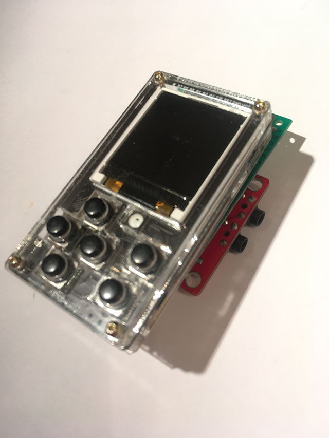
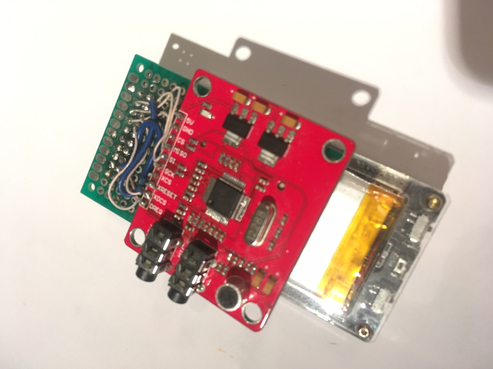

# ESPboy_RFID/NFC

[Demo video](https://youtu.be/YB7mS0z7oJQ)

The ESPboy PN532 NFC/RFID module allows you to read/write RFID/NFC cards

- 1k, 4k, Ultralight and DesFire cards
- ISO/IEC 14443-4 cards as CD97BX, CD light, Desfire, P5CN072 (SMX)
- Innovision Jewel cards as IRT 5001 card
- FeliCa cards as RCS_860, RCS_854

You can buy this module ready-made or make it yourself.

## 1. Buy PN532 NFC/RFID

- Red [link to buy](https://aliexpress.ru/wholesale?SearchText=PN532)

## 2. Connect PN532 NFC/RFID to ESPboy

- 5v     ->  VCC
- Gnd    ->  GND
- MISO   ->  MI (D6, GPIO12, MISO)
- SI     ->  MO (D7, GPIO13, MOSI)
- SCK    ->  SC (D8, GPIO15)
- XCS    ->  B5 (MCP23017 B5)
- XRESET ->  RST 
- XDCS   ->  B7 (MCP23017 B7)
- DREQ   ->  B4 (MCP23017 B4)

## 3. Upload this firmware

NOTE: Before compilation, set Arduino IDE settings

-  Board:  ESP8266 WeMos D1 mini
-  CPU frequency: 160Mhz

## 4. Useful links

- [Buy ESPboy](https://www.tindie.com/products/23910/)
- [DIY ESPboy](https://easyeda.com/ESPboy)
- [Main Web site](https://www.espboy.com)
- [YouTube channel](https://www.youtube.com/c/ESPboy)
- [Community](https://community.espboy.com)
- [Discord chat](https://discord.gg/kXfDQpX)
- [Twitter](https://twitter.com/ESPboy_edu)
- [Software](https://github.com/ESPboy-edu)
- [Contact: espboy.edu@gmail.com](mailto:espboy.edu@gmail.com)

